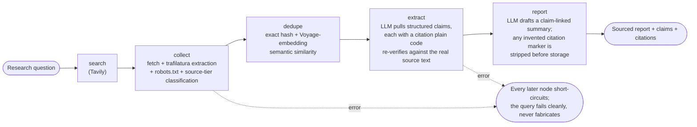

# Personal AI Agent

[](https://github.com/Aziz-ahmad555/personal-ai-agent/actions/workflows/ci.yml)
[](LICENSE)


A personal, single-user AI agent that researches, verifies, and prepares — for job search, technical research, and staying on top of GitHub, Gmail, and Calendar — with a human approving before anything risky executes. Every claim it makes is traceable to real evidence; if the evidence isn't there, it says so instead of guessing.

See [CLAUDE.md](CLAUDE.md) for the full philosophy and build standards this project is held to, and [docs/](docs/) for architecture, design decisions, and the full evaluation writeup.

## What it does

1. **Profile Engine** — structured profile (bio, work history, education, skills), with skill *versions* over time, each backed by recorded evidence, not a single overwritable rating. Embedded via Voyage AI for retrieval.
2. **Research Engine** — a LangGraph pipeline (search → collect → dedupe → extract → report) that turns a question into a sourced answer: every claim carries a verbatim citation that's independently re-verified against the actual fetched page, a deterministic confidence score (source tier + corroboration + recency), and an honest "uncertainties" list rather than a filled-in gap.
3. **Semantic Search** ("Ask your agent") — one cross-corpus query (pgvector) over your profile *and* every research claim/source, resolved back to real rows, never a generated summary.
4. **Career Intelligence** — job discovery (manual capture + Greenhouse/Lever/Ashby/USAJobs board polling) → employer verification & fraud/scam detection → weighted match scoring (evidence-only, never keyword-only) → an application tracker → resume tailoring (a reviewable diff, never a silent rewrite) → fact-checked cover letters → an ATS compatibility checker → interview practice with scored feedback.
5. **Gmail integration** (read-only) — OAuth2, `gmail.readonly` only, encrypted tokens, incremental sync with automatic backfill fallback.
6. **GitHub integration** (read-only) — repo import as skill evidence (deterministic, no LLM) and a recruiter-readiness review of your own public repos.
7. **Calendar integration** (read-only) — connected today; event reading and interview/deadline detection are the next sub-step (see [Limitations](#limitations-and-roadmap)).
8. **Reporting** — a weekly digest aggregating career/research/Gmail/GitHub/Calendar activity and "needs attention" signals, exportable as PDF.
9. **Audit & Approval system** — every risky action is Green (automatic), Yellow (you confirm), or Red (you confirm *and* the server independently re-verifies before honoring it) — see [Safety by design](#safety-by-design).
10. **Autonomous scheduling** — the already-Green, read-only actions (GitHub/job-feed/Gmail/Calendar sync, digest generation) now also run on a schedule, not just on a click, with a kill switch and a reauth banner so a silent failure surfaces the next time the app is open.
11. **Privacy & data control** — Fernet-encrypted OAuth tokens, a per-task LLM token limit + daily spend cap, and both a per-integration disconnect-and-purge *and* a genuine, red-risk, two-step full-account deletion.

LinkedIn, Indeed, and Fiverr are **not** integrated, on purpose: none offer authorized API access for a personal developer account, and scraping or browser automation would violate their terms — see [docs/decisions.md](docs/decisions.md).

## Results

Measured, not assumed — from the eval harness (`evals/run_all.py`; methodology and full breakdown in [docs/evaluation.md](docs/evaluation.md)):

| Suite | Result | What it means |
|---|---|---|
| Profile/RAG retrieval | **87.5% hit@1** (14/16), mean score 0.9375 | Given a query, does the right profile/research chunk come back top-ranked? |
| Research Engine (citation correctness) | **4/4** | A fabricated citation marker is stripped before storage; a real one always survives |
| Career Intelligence (hallucination precision/recall) | **13/13** | Cover-letter/resume drafts: every genuinely-grounded sentence kept, every hallucinated or injected one caught |
| Approval/audit adversarial set | **25/25** + 1/1 isolation | Prompt-injection and audit-bypass attack cases (7 from the original red-team pass + 18 added for this harness) |
| Live end-to-end injection check | **1/1** | One real draft, real model, real verifier — no hallucinated claim survived |
| LLM-judge calibration | **14/14 (100%)** | The judge's faithful/relevant verdicts agree with hand-assigned human labels on every gold-set example |
| Judge-scored faithfulness/relevance | **15/15** | Scenario grid: faithful+relevant, unfaithful, irrelevant, hedged, contradicted-by-a-second-source, etc. |
| Baseline comparison | 3/3 | See note below — this one doesn't show what you'd expect |
| Backend test suite | **785 passed** | Full suite, `pytest --cov=app` |
| Frontend test suite | **227 passed** | `vitest run` |
| Backend coverage | **83%** | 9,109 statements, 1,527 missed — measured 2026-09-26 |

**Honest note on the baseline comparison:** this check sends the same source text to a raw model with no retrieval/citation pipeline, to see whether it fabricates specifics the source never stated (a salary figure, a hiring manager's name, a team size). In the runs recorded so far, the raw model didn't fabricate on these particular narrow, omission-type questions either — so this specific comparison is a **regression canary**, not proof the verification pipeline is dramatically outperforming a plain LLM call. The pipeline's real value shows up in the adversarial and hallucination-precision numbers above, where the *source text itself* contains the injected/fabricated claim — that's the case a citation-verified quote check alone can't catch, and where the pipeline's deterministic verifiers (not the model) are what actually holds the line.

**Cost, for scale:** a full `--live` eval run (17 real LLM calls across every bucket) costs an estimated **$0.0041** and takes about 26 seconds.

## Architecture

```mermaid
flowchart TB
    subgraph Client["Frontend — React + TypeScript"]
        UI["React SPA (Vite)<br/>Cmd/Ctrl+K command palette, TanStack Query, Zustand"]
    end

    subgraph API["Backend — FastAPI (async)"]
        Auth["Auth<br/>JWT / OAuth2 password flow"]
        Profile["Profile Engine"]
        Research["Research Engine<br/>(LangGraph — see below)"]
        Search["Semantic Search"]
        Career["Career Intelligence<br/>discovery · verification · fraud<br/>matching · applications · resume<br/>cover letters · ATS · practice"]
        Gmail["Gmail<br/>(read-only)"]
        GitHub["GitHub<br/>(read-only)"]
        Calendar["Calendar<br/>(read-only)"]
        Reporting["Reporting<br/>weekly digest + PDF"]
        Audit["Audit & Approval<br/>Green / Yellow / Red<br/>+ second-check registry"]
        Scheduler["APScheduler<br/>background jobs"]
        CostGuard["LLM cost guard<br/>SpendGuardedProvider"]
    end

    subgraph Data["Storage"]
        PG["PostgreSQL + pgvector"]
        Redis["Redis<br/>rate limiting / cache"]
    end

    subgraph External["External APIs"]
        TavilyAPI["Tavily (search)"]
        VoyageAPI["Voyage AI (embeddings)"]
        LLMAPI["Groq / Gemini / Anthropic (LLM)"]
        GoogleAPI["Google (Gmail, Calendar)"]
        GitHubAPI["GitHub App"]
        Boards["Greenhouse / Lever / Ashby / USAJobs"]
    end

    UI -->|Bearer JWT| API
    Auth --> PG
    Profile --> PG
    Profile -.->|embed| VoyageAPI
    Research --> PG
    Search --> PG
    Career --> PG
    Career -.->|extract / match / draft| LLMAPI
    Career -.->|discover| Boards
    Gmail -->|OAuth2| GoogleAPI
    Calendar -->|OAuth2| GoogleAPI
    GitHub -->|GitHub App| GitHubAPI
    Reporting --> PG
    Audit --> PG
    Scheduler --> Career
    Scheduler --> Gmail
    Scheduler --> Calendar
    Scheduler --> GitHub
    Scheduler --> Reporting
    CostGuard -.->|wraps every call| LLMAPI
    CostGuard --> PG
    API --> Redis
```



**The Research Engine's own pipeline** (the one place true LangGraph node orchestration exists) is worth its own diagram — state flows through a typed dict between nodes, so every stage's input/output is inspectable rather than hidden inside one opaque agent loop:



Full component breakdown and request-flow detail: [docs/architecture.md](docs/architecture.md).

## Safety by design

- **Green / Yellow / Red risk levels, enforced not just labeled.** Green actions log themselves automatically. Yellow/Red actions must go through `request_approval` → `decide_approval`; `log_action` now *raises* if called on anything above Green, closing a real gap where a red-risk action could once be recorded as already-completed with no approval step at all.
- **Red actions get an independent second check — actually independent.** `second_check_passed` used to be a plain boolean the same API caller sent in their own decide request; a red-team pass found that a caller could just assert it. It's fixed by removing the field from the client-facing schema entirely and having `decide_approval` itself run a registered, server-side check (`app.audit.second_checks`) against the stored evidence, at decision time. If a red action has no registered check, approval is refused outright — shipping one unchecked is loud, never silent.
- **The approval gate itself is race-proof.** A red-team pass found a real TOCTOU race in `decide_approval` (two concurrent decisions on one pending row). Fixed with one atomic `UPDATE ... WHERE` instead of select-then-write, so the database's own row lock — not application logic — makes a double-decision impossible.
- **Prompt injection: verified against the actual defense, not model good behavior.** Untrusted content (job postings, fetched pages, claims sourced from the web) is wrapped and labeled in every prompt that touches it (`wrap_untrusted`) — but that's explicitly *defense-in-depth, not the defense*. The real guardrail is deterministic, after the fact: every cover-letter sentence, resume rewrite, and requirement extraction is independently checked against the candidate's own recorded evidence (`cover_verify.py`, `resume_verify.py`, `practice_verify.py`) — an attacker who gets adversarial text verbatim into a job posting still can't get an unsupported claim into anything the app produces, because nothing the model outputs is trusted, only what a deterministic check confirms against real data.
- **No send/post/delete tool is ever bound to an LLM call.** A structural regression test (`test_redteam_structural_guards.py`) scans the source for this and fails CI if it's ever untrue.
- **SSRF-checked outbound fetches.** The one place the app fetches an arbitrary external URL (a job posting captured by URL, or a research source) validates the target address — a red-team pass found this was originally unchecked, meaning a URL (or a redirect) pointing at localhost, an RFC1918 address, or the cloud metadata endpoint would have been fetched like any public page.
- **Least-privilege OAuth everywhere.** `gmail.readonly` only, `calendar.events.readonly` only, a GitHub App with no permissions beyond mandatory `metadata:read` (the callback refuses to connect at all if GitHub ever reports write/admin access). Every granted scope is checked against what was requested, never assumed.
- **Encrypted at rest, never logged.** OAuth tokens are Fernet-encrypted; passwords are hashed; none of it is ever returned by an endpoint or written to a log or the audit trail.
- **A real cost guard, not just a config value.** `SpendGuardedProvider` wraps every LLM call and refuses one outright once a task's own tokens, or the day's total spend (a persisted ledger, not an in-memory counter), are at or beyond their limit — enforced separately from the eval harness's own instrumentation, specifically so an eval run can never trip the production cap or write into the production ledger.
- **Retry/backoff and graceful failure on every external call** — Tavily, Voyage, the LLM providers, Gmail, GitHub, Calendar — each classifying transient-vs-permanent failure per that provider's own error shape; a down dependency fails the request cleanly with a real error, never a fabricated answer or a crash.
- **Deletion that's actually deletion.** Full-account deletion is a two-step Red action: the request files a live evidence snapshot; approving it re-verifies that snapshot against the database *at that exact moment*, refusing if anything drifted, then revokes every connected integration at its provider and deletes every owned row in one call.

## Privacy

This is a single-user, self-hosted agent: everything it stores lives in **your own local Postgres database**, never a third-party server this project controls. Nothing leaves that database except the specific third-party call a feature actually makes — Tavily for a search, Voyage for an embedding, Groq/Gemini/Anthropic for an LLM step, or the Gmail/Calendar/GitHub APIs for those integrations — and only the minimum that call needs, never a bulk export.

**What's stored:** your profile (bio, work history, education, skills and their evidence history), preferences, research queries/claims/sources, career data (postings, matches, employer/fraud checks, applications, tailored resumes, cover letters, practice sessions), a weekly digest snapshot, and — once connected — Gmail message metadata + plain-text body (no raw MIME, no attachments), a read-only snapshot of Calendar events, and GitHub repo/skill-evidence metadata. Every risky action taken or proposed is separately recorded in the audit trail (`AuditLog`: what, why, evidence, risk level, decision, result) via `app/audit/`.

**What's specifically protected:** passwords are hashed (never stored or logged in plain text); Gmail/Calendar/GitHub OAuth tokens are Fernet-encrypted at rest (`TOKEN_ENCRYPTION_KEY`) and never returned by any endpoint or written to a log or the audit trail. A real secrets scan (regex-based, against the full git history, not just the working tree) has been run against this repo and found no live credentials.

**Retention:** nothing expires automatically. Gmail's first sync is bounded to a rolling window (`GMAIL_SYNC_WINDOW_DAYS`, data-minimization by default) rather than the whole mailbox; everything else persists until you remove it.

**Deleting your data**, two ways:
- **Per integration**: each of Gmail/Calendar/GitHub's own `/connection` DELETE endpoint disconnects and revokes the grant at the provider, with an explicit choice to also purge that integration's synced data — never a silent default either way.
- **Everything, for real**: `POST /auth/delete-account/request` returns a live evidence snapshot (real row counts, real connection statuses) as a pending red-risk approval; `POST /auth/delete-account/{id}/decide` with `{"approved": true}` is your second, explicit confirmation — it re-verifies that snapshot against the database at that exact moment, then revokes every connected integration at its provider and deletes every row this account owns, all in the same call. One honest tradeoff: the account's own audit-log rows are themselves owned by the account, so they're deleted along with everything else — the one thing that outlives a completed deletion is a structured log line written just before it, in the app's own log output, outside Postgres entirely.

## Limitations and roadmap

**Known, open gaps** (each is a documented decision, not an oversight):
- **Refresh-token reuse.** JWT refresh tokens aren't rotated or tracked, so a captured one stays valid until expiry. Accepted for a single-user, local-only app where the realistic threat model doesn't include a network attacker capturing this device's token — but this **must** be fixed before any multi-device or public deployment. Documented, with a regression test that currently records (not enforces) the gap, in `app/auth/router.py`'s `refresh` docstring.
- **A citation-marker fabrication is caught; an uncited assertion isn't.** `report.py`'s marker-stripping drops any sentence whose `[claim_id]` doesn't resolve — but if a model asserts a fact with *no* citation marker at all, nothing currently catches that. A separate, harder problem the module doesn't attempt to solve yet.
- **Retrieval depends on a live embeddings API.** The eval harness's own most recent runs hit a transient Voyage outage; `/search` fails clearly (503) rather than guessing when this happens, but it does mean search has a real external dependency with no offline fallback.
- **The one-active-practice-session lock is in-process only.** `asyncio.Lock`, not a distributed lock — correct for a single-instance deployment (which this is), would need rework before running as more than one worker.
- **Calendar event reading and interview/deadline detection** aren't built yet — only the connection itself is.
- **The optional LLM README critique** for the GitHub recruiter-readiness review isn't built.

**v2 backlog** (deliberately out of scope for now): LinkedIn tooling (no authorized API for a personal developer account — see [docs/decisions.md](docs/decisions.md)), Slack/WhatsApp integrations, a voice interface or mobile app, multi-user accounts, fine-tuning a custom model.

## Quick start

```bash
git clone https://github.com/Aziz-ahmad555/personal-ai-agent.git && cd personal-ai-agent
cp .env.example .env               # fill in real secrets — see Setup below for which ones you need
docker compose up -d               # Postgres (pgvector) + Redis
cd backend && pip install -e ".[dev]" && alembic upgrade head && uvicorn app.main:app --reload
```

Then, in a second terminal:

```bash
cd frontend && npm install && npm run dev
```

Open http://localhost:5173, register the first (and only) user via http://localhost:8000/docs → `POST /auth/register` (registration is bootstrap-only — it works once, then locks), and log in. Full setup detail, per-feature API keys, and end-to-end verification steps: [Setup](#setup) below.

## Tech stack

- **Backend**: FastAPI (async throughout — no blocking calls in a request handler), Pydantic v2, SQLAlchemy 2.0 async + Alembic (a fresh clone builds the schema from nothing — verified against a genuinely empty database), PostgreSQL + pgvector, Redis, structlog (structured, request-ID-traceable logs), JWT/OAuth2.
- **LangGraph** for the Research Engine specifically — not a free-form agent loop, because state needs to flow through an inspectable typed structure between deterministic and LLM steps, not stay hidden inside one opaque loop.
- **Groq** as the default LLM provider — Gemini's free tier (20 requests/day, a same-day 5/minute wall, and sustained server overload at the time this was evaluated) proved too tight for real use; easy to switch back via one setting (`LLM_PROVIDER`) if that changes.
- **Tavily** for search and **Voyage AI** for embeddings — both reasoned about in [docs/decisions.md](docs/decisions.md), honestly: as the technical fit for what this app actually needs, not as a bake-off that happened.
- **Frontend**: React + TypeScript (strict mode) + Vite, Tailwind CSS v4, Radix primitives, TanStack Query, Zustand, Framer Motion, a Cmd/Ctrl+K command palette.
- **CI**: GitHub Actions — lint, format-check, strict typecheck, and the full test suite for both backend and frontend on every push; evals run manually (`workflow_dispatch`) to avoid API cost on every push. See `.github/workflows/`.
- **Infra**: Docker Compose for local Postgres + Redis — a fresh clone works from the README alone.

## Setup

### Prerequisites

- [Docker Desktop](https://www.docker.com/products/docker-desktop/) running (for Postgres + Redis)
- Python 3.11+
- Node 20+

### 1. Start infrastructure

```bash
docker compose up -d
docker compose ps   # confirm both containers are healthy
```

**Note:** Postgres is mapped to host port **5433**, not the default 5432 — a native/standalone Postgres already running on this machine would otherwise silently win the 5432 binding on Windows and auth would fail with no trace in the container's logs. If 5433 is also taken, change `POSTGRES_PORT` in `.env` and `DATABASE_URL`'s port to match.

### 2. Backend

```bash
cd backend
python -m venv .venv
./.venv/Scripts/activate        # Windows
pip install -e ".[dev]"
cp ../.env.example ../.env      # then fill in real secrets
alembic upgrade head
uvicorn app.main:app --reload
```

Settings always load `.env` from the repo root regardless of your working directory.

- API: http://localhost:8000 · Interactive docs: http://localhost:8000/docs · Health check: http://localhost:8000/health

**Which keys you actually need**, by feature:
- **Embeddings** (optional for profile CRUD, required for Search): `VOYAGE_API_KEY` (https://dash.voyageai.com). Without it, profile CRUD still works fully; embeddings are skipped with a logged warning, never faked.
- **Research Engine** (required to run at all): `TAVILY_API_KEY` (https://tavily.com), plus `LLM_PROVIDER` (`groq` by default) and the matching key — `GROQ_API_KEY` (https://console.groq.com), `GEMINI_API_KEY` (https://aistudio.google.com/apikey), or `ANTHROPIC_API_KEY` (https://console.anthropic.com). Missing keys fail the query cleanly with an `error` field.
- **Career Intelligence — job discovery**: Greenhouse/Lever/Ashby need no key. USAJobs needs a free `USAJOBS_API_KEY` (https://developer.usajobs.gov) plus `USAJOBS_USER_AGENT_EMAIL` (required by their terms). Manual capture reuses the Research Engine's keys above.
- **Gmail / Calendar**: an OAuth 2.0 Client ID at https://console.cloud.google.com/apis/credentials, `GOOGLE_CLIENT_ID`/`GOOGLE_CLIENT_SECRET`, a generated `TOKEN_ENCRYPTION_KEY` (command in `.env.example`), and your own account added as a test user on the consent screen (keep it in "Testing" status — no Google review needed for personal use, but refresh tokens then expire every 7 days; reconnect from `/gmail` or `/calendar` when that happens).
- **GitHub**: register a **GitHub App** (not an OAuth App — see `docs/architecture.md` for why), once: GitHub → Settings → Developer settings → GitHub Apps → New GitHub App. Callback URL `http://localhost:8000/github/oauth/callback`; untick Webhook → Active; leave every permission at "No access"; keep "Expire user authorization tokens" ticked; "Only on this account". Generate a client secret, then set `GITHUB_CLIENT_ID`/`GITHUB_CLIENT_SECRET` in `.env`.

Run tests (add `--cov=app --cov-report=term` for coverage, same as CI):

```bash
pytest
```

Lint / format / typecheck:

```bash
ruff check .
ruff format --check .
mypy app
```

**Pre-commit hooks** (ruff, ruff-format, mypy, trailing-whitespace, and friends) ship configured but need installing once per clone:

```bash
pre-commit install
```

Run from `backend/`, with the venv active. After that, every `git commit` runs these checks on the changed files; CI runs the same checks again on every push regardless, so a skipped or bypassed local hook still can't reach `main` unnoticed.

### 3. Frontend

```bash
cd frontend
npm install
cp .env.example .env
npm run dev
```

- App: http://localhost:5173 — no users exist on a fresh clone; register the first (and only) one via http://localhost:8000/docs → `POST /auth/register` (bootstrap-only: works once, then locks).

```bash
npm run test              # unit tests
npx playwright install    # first time only
npm run e2e                # end-to-end tests
```

### Verifying end-to-end

1. `docker compose up -d`, confirm both services healthy; backend running, `GET /health` returns `ok` for both.
2. Register the first user via `/docs`, then log in at http://localhost:5173/login.
3. **Profile**: add a work experience, a skill with an evidence-backed assessment, and preferences — a second assessment on the same skill should add to its history, not overwrite it.
4. **Research**: submit a question, watch `pending` → `running` → `completed`, and see sources/claims/citations/report land.
5. **Search** (or Cmd/Ctrl+K): a real profile field or research claim should come back resolved to its actual title, not a floating text blob.
6. **Career**: capture a job posting (`POST /career/jobs/from-url` via `/docs`, no frontend page for capture yet), verify it, match it, tailor a resume, draft a cover letter, run the ATS check — each should show real evidence, not placeholders, and each risky step should show up in `GET /audit/logs`.
7. **Gmail/Calendar/GitHub**: connect each, sync, confirm real data lands (message count, event count, repo list) and that disconnecting asks before deleting anything.
8. **Reporting**: generate a weekly digest and confirm it reflects what you actually did above.

## License

[MIT](LICENSE).

## Contact

Aziz Ahmad — [azizahmad5552@gmail.com](mailto:azizahmad5552@gmail.com)
